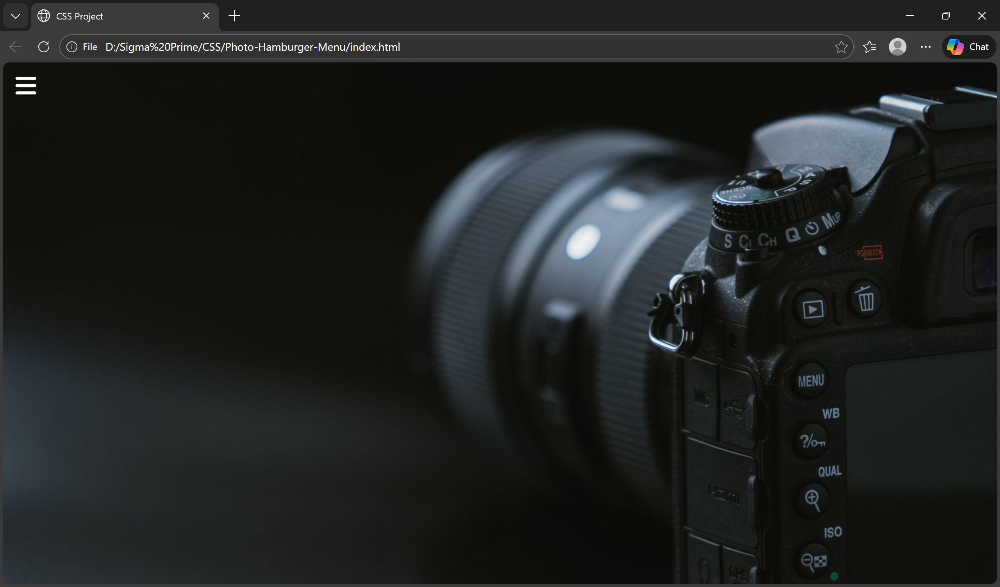
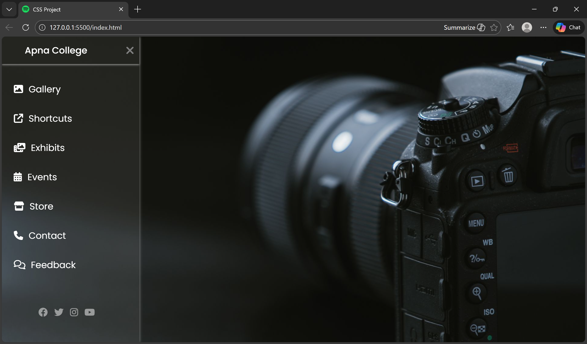

# 📸 Photo-Hamburger-Menu

A modern **photography-themed frontend UI** featuring a **CSS-based hamburger menu** with a full-screen background image. This project is built using **only HTML and CSS**, without any JavaScript.
> 🎓 This is my **first CSS project**, created while learning frontend development with guidance from **Apna College**.


---

## ✨ Features

* 📷 Photography-themed background layout
* 🍔 Pure CSS hamburger (sidebar) menu
* 🎨 Clean and minimal UI design
* 🚫 No JavaScript used

---

## 🛠️ Tech Stack

* **HTML5**
* **CSS3** (Flexbox / positioning)

---

## 📂 Project Structure

```
Photo-Hamburger-Menu/
├── index.html
├── style.css
├── photo.jpg (background image)
└── README.md
```

---

## 🚀 Getting Started

1. Clone the repository:

   ```bash
   git clone https://github.com/Akarsh-Coding/Photo-Hamburger-Menu.git
   ```
2. Open `index.html` in your browser.

---

## 📌 Usage

This project can be used as:

* A UI practice project
* A portfolio frontend design
* A base layout for photography or gallery websites

---

## 📸 Preview

\


---

## 🧑‍💻 Author

**Akarsh Kumar**

---

## 📄 License

This project is for learning and personal use.

---

⭐ If you like this project, consider giving it a star on GitHub!
